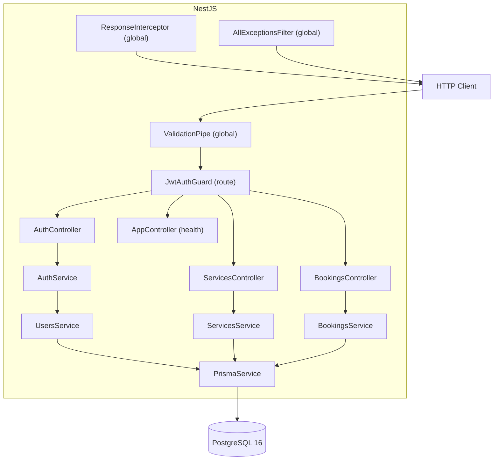
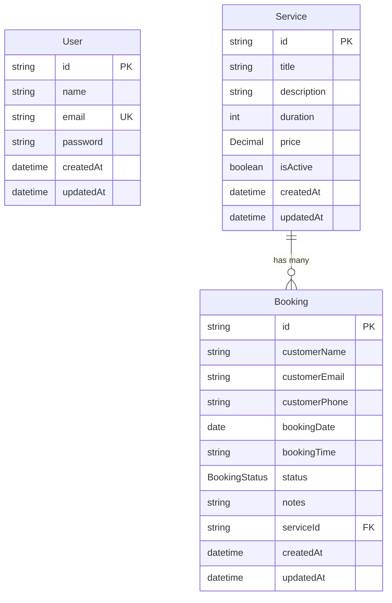

# Architecture — StudioBook API

## System Overview

The StudioBook API is a NestJS application organized around four business domains: authentication, users, services, and bookings. A single PostgreSQL 16 database stores all application data, accessed through Prisma ORM 7 using the official `@prisma/adapter-pg` driver adapter. Swagger/OpenAPI provides interactive documentation. Docker Compose orchestrates local and CI environments.

```
Client (HTTP)
    |
    v
[NestJS Application]
    |-- Global Prefix /api
    |-- ValidationPipe (whitelist, transform, forbidNonWhitelisted)
    |-- JwtAuthGuard (selected routes)
    |-- ResponseInterceptor (success envelope)
    |-- AllExceptionsFilter (error envelope)
    |
    |-- Controllers --> Services --> PrismaService --> PostgreSQL
    |
    \-- Swagger UI (/docs)
```

## Mermaid Component Diagram



## Module Responsibilities

| Module | Responsibility |
|---|---|
| **AppModule** | Root module. Registers ConfigModule (Joi validation), PrismaModule, AuthModule, UsersModule, ServicesModule, BookingsModule. Binds ResponseInterceptor and AllExceptionsFilter globally via APP_INTERCEPTOR / APP_FILTER. |
| **AuthModule** | JWT registration, login, Passport JWT strategy, protected profile. |
| **UsersModule** | User data access via PrismaService. Used internally by AuthModule. |
| **ServicesModule** | Studio service CRUD with case-insensitive title uniqueness and relational deletion guard. |
| **BookingsModule** | Public booking creation with business rule validation, protected listing/management, status lifecycle, cancellation. |
| **PrismaModule** | Global PrismaService providing database access. Manages pg Pool lifecycle. |
| **Common** | `ResponseInterceptor`, `AllExceptionsFilter`, `JwtAuthGuard`, `@ResponseMessage` decorator, `@CurrentUser` decorator. |

## Request Lifecycle

1. **HTTP request** arrives at the NestJS platform adapter.
2. **Global prefix** `/api` is matched by the router.
3. **ValidationPipe** parses and validates the request DTO. Unknown fields are rejected. DTOs are transformed (e.g., strings to numbers).
4. **JwtAuthGuard** (when applied to the route) extracts and verifies the Bearer token. The JWT strategy reads `sub` and `email` from the token, retrieves the current user from the database, removes the password, and attaches the sanitized user object to `req.user`.
5. **Controller** receives the validated DTO and delegates to the service.
6. **Service** applies business logic (rules, existence checks, conflict detection) and calls `PrismaService`.
7. **PrismaService** executes the database query via the `pg` Pool and Prisma adapter.
8. **ResponseInterceptor** wraps the service return value in the standard success envelope, reading the `@ResponseMessage` decorator from the handler.
9. **AllExceptionsFilter** intercepts any thrown exception and formats it as the standard error envelope with `success: false`, status code, message, timestamp, and path.

## Authentication Flow

1. **Registration** (`POST /api/auth/register`): The DTO is validated, the email is checked for uniqueness, the password is hashed with bcrypt (cost 10), and the user is stored.
2. **Login** (`POST /api/auth/login`): Email lookup, bcrypt comparison, JWT signed with `{ sub: userId, email }` and configured `JWT_SECRET` / expiry.
3. **Protected routes**: `JwtAuthGuard` extracts the Bearer token. `JwtStrategy` reads `sub` and `email` from the token, retrieves the current user from the database, removes the password, and attaches the sanitized user object to `req.user`.
4. **Current user**: `@CurrentUser()` decorator extracts `req.user` from the execution context.

## Data Model



**BookingStatus enum:** `PENDING`, `CONFIRMED`, `CANCELLED`, `COMPLETED`

## Booking Workflow

**Creation validation:**
1. Service must exist.
2. Service must be active (`isActive = true`).
3. Booking date must not be in the past (midnight comparison).
4. Booking time must match `HH:mm` format (enforced by DTO regex).
5. No existing booking with the same `serviceId + bookingDate + bookingTime` (three-layer protection: application-level `findFirst`, database composite unique constraint, and Prisma P2002 fallback).

**Status management:**
- `COMPLETED` is terminal — no further status changes or cancellations.
- `CANCELLED` cannot be moved to `COMPLETED`.
- All other transitions via `PATCH /api/bookings/:id/status` are allowed.
- `PATCH /api/bookings/:id/cancel` sets status to `CANCELLED` unless already `COMPLETED`.

## Error and Response Architecture

**ResponseInterceptor** (global, via `APP_INTERCEPTOR`):
- Detects whether the service returned a paginated payload `{ data, meta }` and wraps it accordingly.
- Reads `@ResponseMessage('...')` from the route handler or controller class via the Reflector.
- Passes already-formatted responses through without double-wrapping.

**AllExceptionsFilter** (global, via `APP_FILTER`):
- Catches all exceptions — `HttpException` subclasses (400, 401, 403, 404, 409, etc.) and generic `Error`.
- Maps Nest validation exceptions (array messages) to a structured `errors` array.
- Logs unexpected 500 errors with the NestJS Logger.
- Never exposes internal stack traces.

## Docker Architecture

| Component | Description |
|---|---|
| `db` service | PostgreSQL 16 Alpine. Named volume `postgres_data`. Health checked via `pg_isready`. |
| `app` service | Multi-stage Node.js image (builder + production). Depends on `db` health. |
| Startup command | `npx prisma generate && npx prisma migrate deploy && node dist/main` — migrations are applied before the API starts. |
| Internal hostname | The `app` container reaches PostgreSQL at `db:5432` (Docker Compose internal network). |
| Host exposure | `db` is exposed on host port `5434`. `app` is exposed on host port `3000`. |
| Seed | Explicit — `docker compose exec app npm run prisma:seed`. Never automatic. |

**Test database** (`docker-compose.test.yml`):
- Separate PostgreSQL instance on host port `5435`, database name `studiobook_test`.
- Started manually before E2E runs and torn down with `-v` after.

## Test Architecture

| Layer | Description |
|---|---|
| **Unit tests** | Jest + `@nestjs/testing`. PrismaService is replaced by a mock object using `jest.fn()`. No database connection. Typed mock helpers (`mockBooking`, `mockService`) eliminate `as any` casts. |
| **E2E tests** | Supertest + real NestJS application. Connects to the isolated `studiobook_test` database at port `5435`. A safety guard in `test/setup-env.ts` aborts if `DATABASE_URL` does not contain `studiobook_test`. Tables are cleaned in `beforeAll` and `afterAll`. `app.close()` triggers `PrismaService.onModuleDestroy` which disconnects Prisma and ends the pg Pool. |
| **Coverage** | Collected from unit tests only via `jest --coverage`. Excludes the E2E suite. |

## Design Decisions and Tradeoffs

| Decision | Rationale |
|---|---|
| **Public booking creation** | Customers do not need an account — reduces friction for studio bookings. |
| **Staff-only management** | Any authenticated user can manage services and bookings. No role differentiation was required. |
| **Exact-slot duplicate prevention** | Three-layer protection: 1. Application-level `findFirst` check provides a friendly conflict response. 2. Prisma schema contains `@@unique([serviceId, bookingDate, bookingTime])`. 3. A Prisma `P2002` error is converted to `ConflictException` as a concurrency-safe fallback. |
| **Case-insensitive service title uniqueness** | `mode: 'insensitive'` Prisma query instead of a database unique index. Title uniqueness is a UX rule, not a data integrity constraint. |
| **Prisma Decimal conversion** | `price.toNumber()` in `mapBooking` converts `Prisma.Decimal` to a plain number before returning it in the response, avoiding JSON serialization issues. |
| **pg Pool in PrismaService** | Storing the pool as a private field allows `onModuleDestroy` to call `pool.end()`, preventing Jest open-handle warnings and ensuring clean shutdown in production. |
| **No RBAC** | Out of scope. All authenticated users are treated as staff. |
| **No refresh tokens** | Out of scope. Access tokens expire after the configured duration. |
| **CommonJS seed script** | `prisma/seed.cjs` uses `require()` so it runs directly with `node` inside the Docker image without adding `tsx` as a runtime dependency. |
